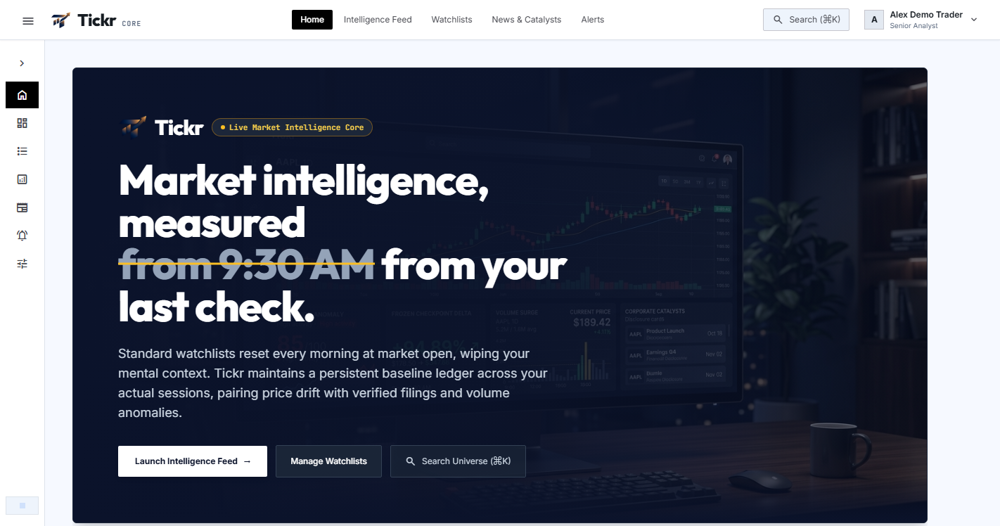
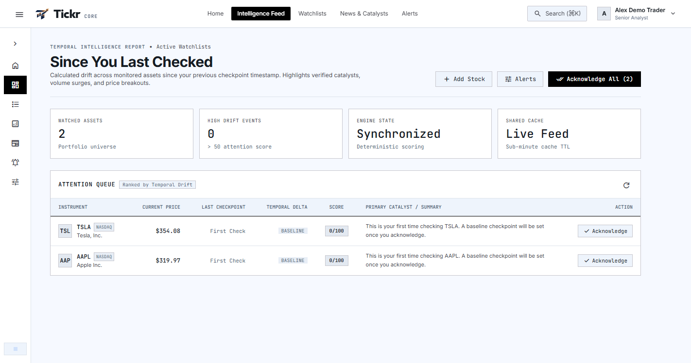
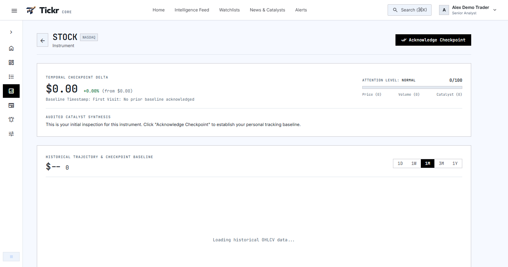
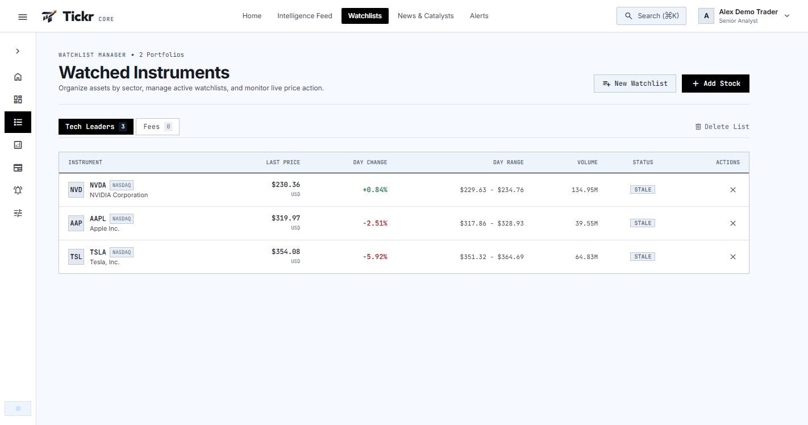
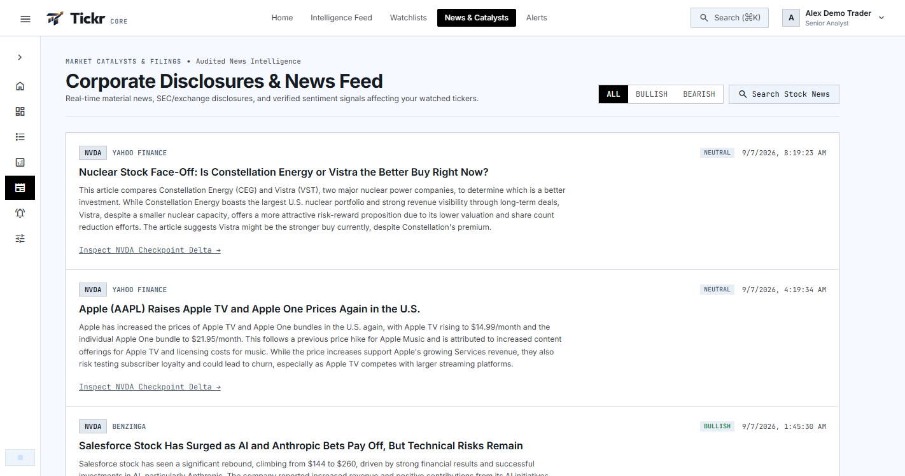
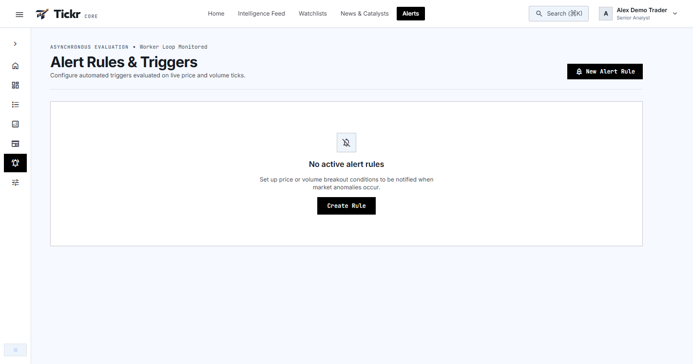
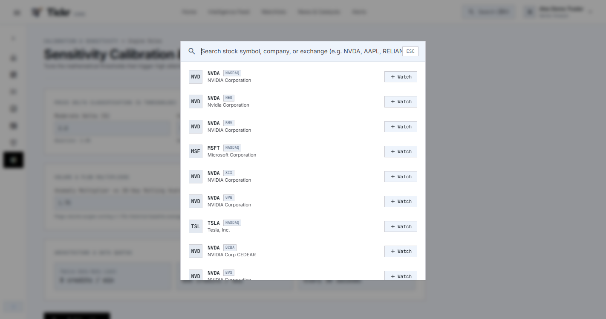
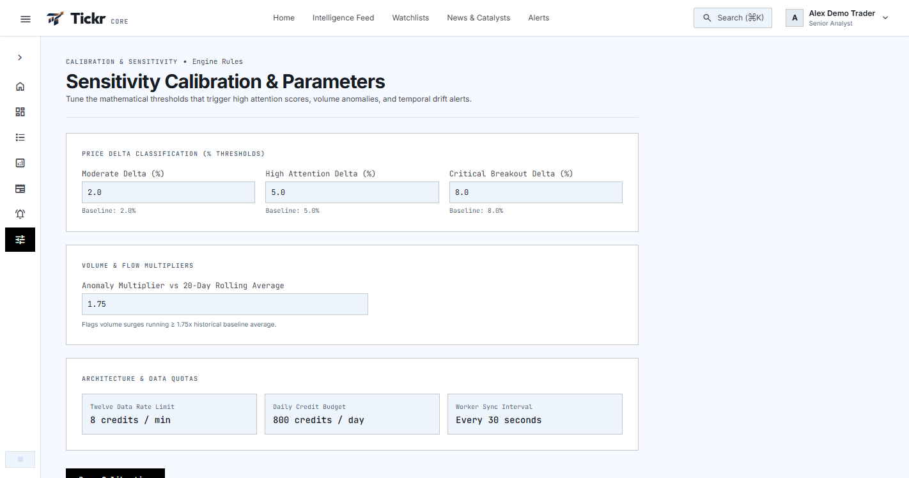

# Tickr — Smart Market Watchlist & Intelligence Platform

> A modern, full-stack financial market intelligence platform featuring a persistent **"Since You Last Checked"** intelligence layer. Tickr remembers what each user has previously acknowledged for every stock, detects significant market moves, calculates multi-factor attention scores ($0..100$), and provides transparent evidence chains without hallucinating causality.

---

## Interactive Video Demo & Screenshots

### Full Animated Walkthrough Video
The project includes a complete screen recording demonstrating the user experience, animations, chart interactions, checkpoint syncing, and keyboard navigation:
* **Demo Video File**: [`/screenshots/tickr_demo_walkthrough.mp4`](./screenshots/tickr_demo_walkthrough.mp4) *(and [`/recordings/tickr_demo_walkthrough.mp4`](./recordings/tickr_demo_walkthrough.mp4))*

---

### High-Resolution Screenshots (Full Workspace / Collapsed Sidebar)

All screenshots are stored in the [`/screenshots`](./screenshots) directory:

| Landing Page | Intelligence Feed Dashboard |
|:---:|:---:|
|  |  |
| *Modern landing view with live ticker ribbon & feature highlights* | *Ranked intelligence overview highlighting stocks requiring attention* |

| Stock Detail & Intelligence Layer | Watchlists Management |
|:---:|:---:|
|  |  |
| *Interactive OHLCV/Candlestick chart, indicators, and checkpoint comparison* | *Custom watchlists with live market snapshots and drag-and-drop order* |

| Market News & Catalysts | Price & Volatility Alerts |
|:---:|:---:|
|  |  |
| *Deduplicated financial news feed linked to watched tickers* | *Configurable price threshold and volatility shift alert rules* |

| Quick Symbol Search (`Ctrl+K` / `⌘K`) | Engine Calibration & Settings |
|:---:|:---:|
|  |  |
| *Instant search across instruments and exchanges with keyboard navigation* | *Configurable attention formula weights and provider thresholds* |

---

## Key Features & Innovations

### 1. "Since You Last Checked" Intelligence Engine
* **User-Specific Checkpoints (`UserStockCheckpoint`):** Unlike generic watchlists that only show daily change, Tickr computes personalized price, volume, and volatility deltas relative to **when you specifically last inspected the stock**.
* **One-Click Acknowledgment:** Monotonically advances your checkpoint timestamp to the current market state and records an auditable change log.
* **Deterministic Attention Score ($0..100$):** Multi-factor scoring combining price moves, volume anomalies vs. 20-day rolling averages, ATR volatility shifts, technical indicators (RSI/MACD), and news recency.
* **Transparent Evidence Chain:** Explains *why* attention is flagged with auditable data points (e.g. `+8.7% price jump`, `2.4x volume surge`, `RSI overbought signal`).

### 2. High-Throughput & Resilient Backend
* **Modular Monolith in Fastify v5:** Sub-millisecond routing, strict schema validation, distributed rate limiting, and structured JSON logging with Pino.
* **Shared Market Cache with Stampede Protection:** Background workers refresh the union of watched stocks into Redis with mutex locks, preventing provider overload even with thousands of concurrent users.
* **Provider Quota Budget Manager:** Proactive minute and daily budget enforcement for Twelve Data / Alpha Vantage with automatic degradation to cached snapshots.
* **PostgreSQL & Prisma ORM:** ACID transactions for Compare-And-Swap (CAS) checkpoint updates, foreign keys, compound indexes, and audit logs.

### 3. Modern Frontend Experience
* **React 18 + Vite + TypeScript + Tailwind CSS:** Terminal-inspired UI with high contrast, responsive sidebar, and custom animations.
* **Interactive Charting:** Canvas and SVG candlestick/line charts powered by Recharts with timeframes (`1D`, `1W`, `1M`, `3M`, `1Y`, `ALL`).
* **Keyboard-First Navigation:** Global shortcut modal (`Ctrl+K` / `⌘K`), direct view switches (`H`, `1`-`6`), and instant stock selection.

---

## Architecture & Technology Stack

```text
┌─────────────────────────────────────────────────────────────┐
│                   React 18 + Vite Frontend                  │
│       (Tailwind CSS, Lucide Icons, Recharts, Context API)   │
└──────────────────────────────┬──────────────────────────────┘
                               │ HTTPS / Bearer Token & Cookies
                               ▼
┌─────────────────────────────────────────────────────────────┐
│                 Fastify v5 Backend (Node.js 22)             │
│   ├── Auth Module (JWT + Refresh Tokens + Argon2/Bcrypt)   │
│   ├── Watchlists & Instruments Module                       │
│   ├── "Since You Last Checked" Intelligence Engine          │
│   ├── Market Data Cache & Provider Manager                  │
│   └── Observability (Pino Logger, Prometheus /metrics)      │
└──────────────┬──────────────────────────────┬───────────────┘
               │                              │
               ▼                              ▼
┌─────────────────────────────┐  ┌────────────────────────────┐
│      PostgreSQL 16          │  │     Redis 7 (ioredis)      │
│  (Relational Core & Prisma) │  │  (Shared Cache & BullMQ)   │
└─────────────────────────────┘  └────────────┬───────────────┘
                                              │
                                              ▼
                                 ┌────────────────────────────┐
                                 │   BullMQ Background Worker │
                                 │  (Quotes, News & Alerts)   │
                                 └────────────────────────────┘
```

| Layer | Technology | Description |
|---|---|---|
| **Frontend** | React 18, Vite, TypeScript, Tailwind CSS | Single-Page Application with responsive navigation |
| **Backend API** | Node.js 22+, TypeScript, Fastify v5 | High-performance asynchronous API server |
| **Database** | PostgreSQL 16 (Neon / Local) + Prisma ORM | Relational persistence with compound indexes and migrations |
| **Caching & Queues** | Redis 7 (Upstash / Local) + BullMQ | Shared quote cache, distributed locks, rate limiting |
| **Market Data** | Twelve Data API & Alpha Vantage | Real-time and historical quotes with zero-config mock fallback |
| **Testing** | Vitest, Supertest | Comprehensive unit and integration test suite |

---

## Fresh Setup & Run Guide (From Scratch)

> **Note for Evaluators & Reviewers:** This project is designed to run seamlessly on a fresh machine **without pre-existing `node_modules` or secret `.env` files**. It includes built-in mock market data providers and a 1-command local database setup.

---

### System Requirements
* **Node.js**: `v20.x` or `v22.x+` ([Download Node.js](https://nodejs.org/))
* **npm**: `v10.x+` (comes bundled with Node.js)
* **Docker & Docker Compose** *(Recommended for local PostgreSQL & Redis)* — OR free cloud instances from [Neon.tech](https://neon.tech) and [Upstash.com](https://upstash.com).

---

### 3-Minute Quickstart

#### Step 1: Clone or Extract the Repository
```bash
git clone https://github.com/aparnaparashar/Tickr.git
cd Tickr
```

---

#### Step 2: Setup & Launch Backend

Open a terminal in the root directory:

```bash
# 1. Enter the backend directory
cd backend

# 2. Install dependencies from scratch
npm install

# 3. Create your local .env file from the provided template
# On Linux / macOS / Git Bash:
cp .env.example .env

# On Windows PowerShell:
Copy-Item .env.example .env

# 4. Start local PostgreSQL (port 5432) and Redis (port 6379) via Docker:
docker compose up -d

# 5. Initialize the database schema and push tables:
npx prisma generate
npx prisma db push

# 6. Seed initial stock universe, demo user, watchlists, and past visit checkpoints:
npm run db:seed

# 7. Start the backend development server:
npm run dev
```

* **Backend Status:** The API server will start at `http://localhost:4000`.
* **API Docs:** Interactive Swagger UI is available at `http://localhost:4000/docs`.

---

#### Step 3: Setup & Launch Frontend

Open a **second terminal window** in the project root:

```bash
# 1. Enter the frontend directory
cd frontend

# 2. Install dependencies from scratch (zero env config required)
npm install

# 3. Start the Vite development server
npm run dev
```

* **Frontend Status:** Open your browser and navigate to:
  `http://localhost:3000`

---

### Instant Login & Test Credentials

The database seeder automatically provisions a ready-to-test analyst account:

| Attribute | Value |
|---|---|
| **Email** | `demo@example.com` |
| **Password** | `password123` |
| **Pre-populated Watchlist** | *Tech Leaders* (`NVDA`, `AAPL`, `TSLA`) |
| **Simulated Visit Checkpoint** | Prior visit checkpoint recorded at `$118.20` for NVDA (vs `$128.50` current price) to demonstrate the **"Since You Last Checked"** delta calculation & attention scoring engine out of the box. |

*(You can also register a new account instantly using the "Sign In" button in the top right).*

---

### Zero-Config Provider Modes (Real vs. Mock Data)

In `backend/.env`, you can choose between live external market APIs or zero-config mock data:

```env
# OPTION A: Built-in Mock Mode (Zero external API keys needed)
MARKET_PROVIDER=mock
NEWS_PROVIDER=mock

# OPTION B: Live Market Data (Twelve Data + Alpha Vantage)
MARKET_PROVIDER=twelve_data
TWELVE_DATA_API_KEY=your_twelve_data_api_key_here
NEWS_PROVIDER=alpha_vantage
ALPHA_VANTAGE_API_KEY=your_alpha_vantage_api_key_here
```

*(The provided `.env.example` defaults to `mock` mode so the entire project works immediately with zero configuration).*

---

### Alternative: Running Without Docker (Cloud Database)

If you do not have Docker installed, simply paste free cloud database connection strings into `backend/.env`:
* **PostgreSQL**: [Neon.tech](https://neon.tech) (Free Serverless Postgres) -> set `DATABASE_URL="postgresql://..."`
* **Redis**: [Upstash.com](https://upstash.com) (Free Serverless Redis) -> set `REDIS_URL="rediss://..."`

Then run `npx prisma db push && npm run db:seed && npm run dev`.

---

## Keyboard Shortcuts

| Shortcut | Action |
|---|---|
| <kbd>Ctrl</kbd> + <kbd>K</kbd> or <kbd>⌘</kbd> + <kbd>K</kbd> | Open Instant Symbol Search modal |
| <kbd>H</kbd> | Navigate to Landing Page |
| <kbd>1</kbd> | Navigate to Intelligence Dashboard |
| <kbd>2</kbd> | Navigate to Watchlists |
| <kbd>3</kbd> | Navigate to Stock Detail & Chart View |
| <kbd>4</kbd> | Navigate to Market News Feed |
| <kbd>5</kbd> | Navigate to Price & Volatility Alerts |
| <kbd>6</kbd> | Navigate to Settings & API Configuration |

---

## Testing & Verification

### Running Automated Backend Tests
Vitest unit and integration test suite:

```bash
cd backend
npm test
```

### Strict TypeScript Verification
Validate types across both modules:

```bash
# Backend typecheck
cd backend
npm run typecheck

# Frontend build & typecheck
cd ../frontend
npm run build
```

---

## API Endpoint Reference

All endpoints are versioned under `/api/v1`. Interactive Swagger documentation is available at `http://localhost:4000/docs`.

### Auth Endpoints
* `POST /api/v1/auth/register` — Create user account & default watchlist
* `POST /api/v1/auth/login` — Sign in and issue JWT & refresh cookies
* `POST /api/v1/auth/refresh` — Rotate access token
* `POST /api/v1/auth/logout` — Invalidate user session
* `GET  /api/v1/auth/me` — Current authenticated user profile

### Watchlists (IDOR/BOLA Protected)
* `GET    /api/v1/watchlists` — List user watchlists with live market snapshots
* `POST   /api/v1/watchlists` — Create new watchlist
* `GET    /api/v1/watchlists/:id` — Get specific watchlist
* `PATCH  /api/v1/watchlists/:id` — Rename or set as default
* `DELETE /api/v1/watchlists/:id` — Delete watchlist
* `POST   /api/v1/watchlists/:id/items` — Add ticker to watchlist
* `DELETE /api/v1/watchlists/:id/items/:instrumentId` — Remove ticker
* `PATCH  /api/v1/watchlists/:id/items/reorder` — Reorder items

### Stocks & Market Data
* `GET /api/v1/stocks/search?q=:query` — Multi-instrument symbol search
* `GET /api/v1/stocks/:instrumentId` — Instrument profile & overview
* `GET /api/v1/stocks/:instrumentId/quote` — Live quote & freshness tag (`FRESH`, `DELAYED`, `STALE`)
* `GET /api/v1/stocks/:instrumentId/history?range=1M` — OHLCV candlestick historical bars
* `GET /api/v1/stocks/:instrumentId/indicators` — Technical indicators (SMA, EMA, RSI, MACD, ATR)
* `GET /api/v1/stocks/:instrumentId/news` — Deduplicated company news catalysts

### "Since You Last Checked" Intelligence
* `GET  /api/v1/stocks/:instrumentId/changes-since-last-check` — Core delta, attention score ($0..100$) and evidence breakdown
* `POST /api/v1/stocks/:instrumentId/checkpoint/acknowledge` — Advance user checkpoint to current moment and record event
* `GET  /api/v1/stocks/:instrumentId/change-history` — Paginated history of prior acknowledged changes
* `GET  /api/v1/dashboard/changes` — Ranked summary of all watched stocks sorted by attention score

### Health & Observability
* `GET /health/live` — API liveness check
* `GET /health/ready` — PostgreSQL & Redis readiness probe
* `GET /metrics` — Internal metrics registry (latency, cache hit ratio, quota status)

---

## Repository Structure

```text
Tickr/
├── README.md                      # Complete Project Documentation (This File)
├── screenshots/                   # High-Res Screenshots & MP4 Demo Video
│   ├── 01_landing_page.png
│   ├── 02_intelligence_dashboard.png
│   ├── 03_watchlists_view.png
│   ├── 04_stock_detail_intelligence.png
│   ├── 05_market_news.png
│   ├── 06_alerts_manager.png
│   ├── 07_quick_search_modal.png
│   ├── 08_settings_calibration.png
│   └── tickr_demo_walkthrough.mp4 # Full Animated Video Recording
├── recordings/                    # High-Definition Video Recording Archive
│   └── tickr_demo_walkthrough.mp4
├── backend/                       # Fastify v5 TypeScript Backend
│   ├── Dockerfile
│   ├── docker-compose.yml         # Local PostgreSQL & Redis containers
│   ├── package.json
│   ├── tsconfig.json
│   ├── prisma/
│   │   ├── schema.prisma          # Database schema models & indexes
│   │   └── seed.ts                # Database seeder with sample data
│   ├── src/
│   │   ├── app.ts                 # Fastify app configuration & plugins
│   │   ├── server.ts              # API HTTP server entrypoint
│   │   ├── worker.ts              # Background job runner
│   │   ├── config/                # Environment variables & constants
│   │   ├── modules/               # Domain modules (auth, watchlists, checkpoints, etc.)
│   │   ├── providers/             # Market data provider adapters (Twelve Data, Alpha Vantage, Mock)
│   │   ├── cache/                 # Redis connection & cache-aside logic
│   │   └── observability/         # Pino logger, health probes, Prometheus metrics
│   └── tests/                     # Vitest automated test suites
└── frontend/                      # React 18 + Vite Single Page Application
    ├── index.html
    ├── package.json
    ├── tailwind.config.js
    ├── vite.config.ts
    └── src/
        ├── App.tsx                # Main Layout & routing controller
        ├── components/            # Header, Sidebar, StockChart, SearchModal, etc.
        ├── context/               # AuthContext for session management
        ├── pages/                 # Landing, Dashboard, Watchlists, StockDetail, News, Alerts, Settings
        └── services/              # Axios API client
```

---

## License

This project is licensed under the **MIT License**.
